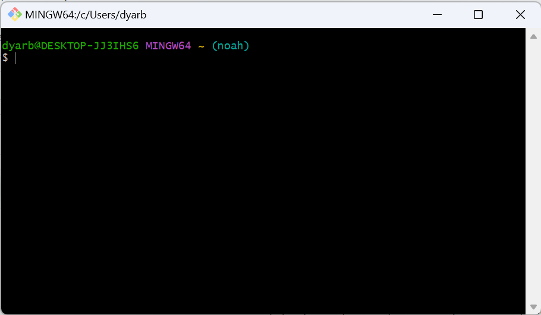
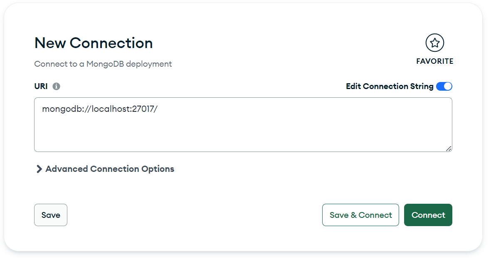

# Meetup Project

This is the Meetup project repository. It's designed to help users connect with others for events and activities.

## Getting Started

Follow these steps to set up and run the project on your local machine.

### Prerequisites

- [Node.js](https://nodejs.org/) installed on your machine.
- [MongoDB](https://www.mongodb.com/try/download/community) installed on your machine.

### Installation

### Open a terminal window (you will need 2nd one open later)

1. **Open terminal**

    

#### 2 terminals running concurrently is essential to run this app

1. **Clone the repository:**

    ```bash
    git clone https://github.com/Ryanslep/Meetup.git
    ```

2. **Change into the project directory:**

    ```bash
    cd Meetup
    ```

3. **Install dependencies:**

    ```bash
    npm install
    ```

4. **Create a `.env` file in the project root and add the following content:**

    ```bash
    touch .env
   ```
    ***Open the code in your IDE (this works for VS Code)***
   ```bash
    code .
   ```
   ***Copy this or your preferred hosting preferences into your ./.env file***
   ```env
    # .env
    DBHOST=localhost
    PORT=3000
    ```

5. **Run your MongoDB server.**
   
    

    Make sure your MongoDB server is running locally.

6. **Run Back End Server from your terminal.**
    ```
    nodemon app.js
    ```
7. **Start a new Terminal window while leaving the first one running**

    
   
9. **Change into the root/client directory:**

    ```bash
    cd Meetup/client
    ```

10. **Install client dependencies:**

    ```bash
    npm install
    ```

11. **Run the project:**

    ```bash
    npm start
    ```

12. **Your default web browser should open, and you can start using the Meetup application.**

    ***Make your browser window narrow like this to simulate mobile***

    

13. **Open/Download Expo go from the ios/android app store**

14. **Scan the QR code with your phone's camera for ios or inside the expo app for android**


## Contributing

If you'd like to contribute to the project, please follow the [contribution guidelines](CONTRIBUTING.md).

# Branch Tips

This is the Meetup project repository. It's designed to help users connect with others for events and activities.

## Pull current master branch to your own branch

Follow these steps to set up and run the project on your local machine and contribute to the development.

### Switch to Existing Branch

1. **Switch to the existing branch with your name:**

    ```bash
    git checkout your_name
    ```

### Install Dependencies

2. **Install dependencies:**

    ```bash
    npm install
    ```

### Make Changes

5. **Make changes to the code as needed.**

### Commit Changes

3. **Commit your changes:**

    ```bash
    git add .
    git commit -m "Add a concise commit message describing your changes"
    ```

### Push Changes

4. **Push changes to your branch:**

    ```bash
    git push origin your_name
    ```

### Create a Pull Request

5. **Create a Pull Request:**

   - Open the repository on GitHub.
   - Switch to the `your_name` branch.
   - Click on "Pull Request."
   - Provide a clear title and description for your changes.
   - Submit the pull request.

### Updating Your Branch

6. **If the master branch is updated:**

    ```bash
    git pull origin master
    ```
7. **Resolve any merge conflicts if necessary.**

## Contributing

If you'd like to contribute to the project, please follow the [contribution guidelines](CONTRIBUTING.md).

## License

This project is licensed under the MIT License - see the [LICENSE](LICENSE) file for details.


## License

This project is licensed under the MIT License - see the [LICENSE](LICENSE) file for details.
